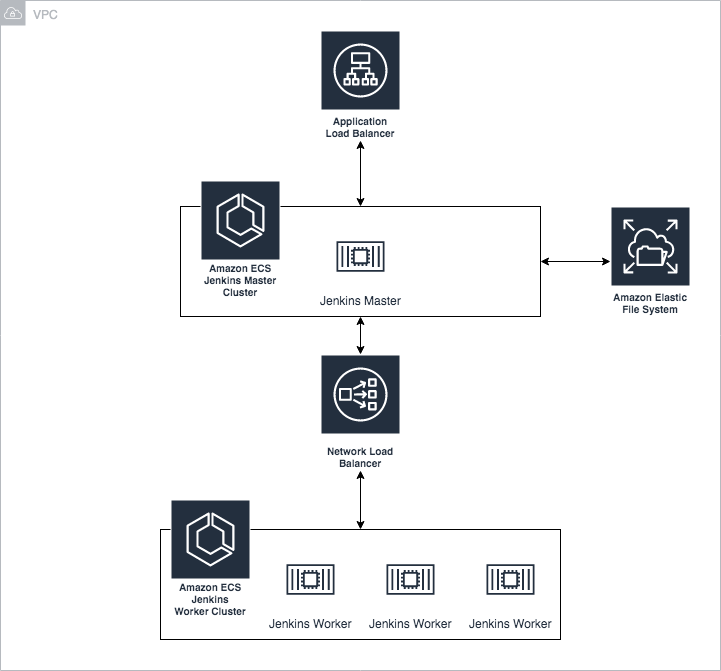
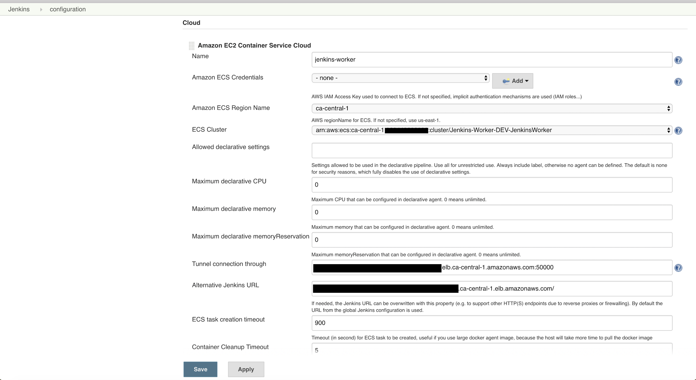
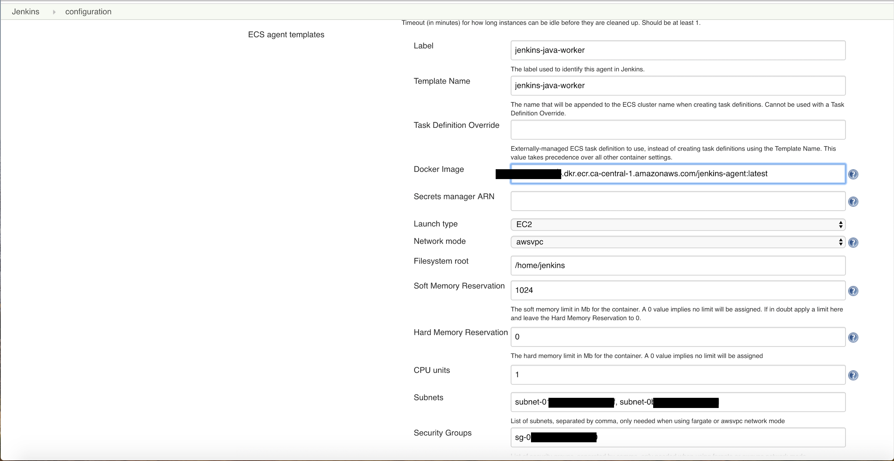
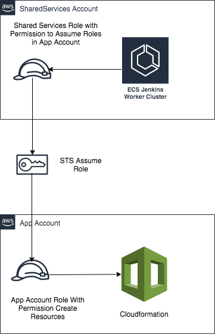

# Cloudformation Project to Deploy ECS based Jenkins Cluster 

This project uses Cloudformation to generate a Jenkins Master and Worker cluster running on AWS Elastic Container Service (ECS)

Note: Cloudformation will only deploy jenkins in private subnets. 


## Usage

- Deploy cf_efs.yaml using CloudFormation to provision EFS and mount targets.

```
aws cloudformation create-stack --stack-name Jenkins-EFS-${Env} --template-body file://CloudFormation/cf_jenkins_ecs.yaml
```

- Output will list the SSM Paramter Name "EFSSSMName" which needs to be passed as Paramter Value in next stack 

- Deploy cf_jenkins_master_ecs.yaml using CloudFormation to provision ALB, NLB, and ECS Cluster with Autoscaling for Jenkins master.

```
aws cloudformation create-stack --stack-name Jenkins-EFS-{Env} --template-body file://CloudFormation/cf_jenkins_master_ecs.yaml
```

- The output will list the ALB's DNS entry where the Jenkins master will be running.
- Deploy cf_jenkins_worker_ecs.yaml using CLoudformation to provision ECS Cluster for Jenkins Worker.

```
aws cloudformation create-stack --stack-name Jenkins-EFS-{Env} --template-body file://CloudFormation/cf_jenkins_worker_ecs.yaml
```

- The output will list the Security Group Id and ECS Cluster name of Jenkins worker which needs to be used to configure ECS Plugin in Jenkins.


## Recommendations

- Client should create their own Jenkins master container with plugins etc. pre-installed.
- The ECSLogGroup variable stores the Cloud Watch log group where the Jenkins logs will be pushed to.
- Jenkins and the EFS file system should be in the private subnets. The public subnets are provided for the ALB.
- The ImageId variable stores the AMI that the ECS cluster will use for its EC2 instances. It must be an ECS optimized image. The custom user data provided assumes this is an Amazon Linux 2 ECS Optimised AMI.

## Design



Jenkins master runs in ECS. The jenkins_home directory is an EFS mount. ECS ensures that Jenkins master is self healing and EFS ensures the configuration and plugins are always available. The EFS file system is mounted with the userdata script. A Cloud Watch log group is created for Jenkins and the logs are pushed to this log group. 


## Dependencies
- Jenkins worker docker image can be buid from `docker_worker` directory and pushed to ECR Repo.

```
docker build -t jenkins-agent

$(aws ecr get-login --no-include-email --region ca-central-1)

docker tag jenkins-agent:latest <AccountID>.dkr.ecr.ca-central-1.amazonaws.com/<ECR-Repo>:latest

docker push <AccountID>..dkr.ecr.ca-central-1.amazonaws.com/jenkins-agent:latest
```
- Amazon Elastic Container Service Plugin Configuration (https://plugins.jenkins.io/amazon-ecs)

### Jenkins Amazon ECS Cloud Config



#### Important Configs
- Amazon ECS Credentials --> EC2 Instance Profile configured are already have permissions to launch tasks in ECS Cluster. This can be configured as None.
- ECS Cluster --> Cluster Arn of the ECS Cluster Created for Jenkins Worker. Value is available in Master CloudFormation Output.
- Tunnel connection through --> NLB DNS Name and port for agents to connect to master using jnlp. Value is available in Worker CloudFormation Output.
- Alternative Jenkins URL --> ALB DNS Name for Master. Value is available in Master CloudFormation Output.



#### Important Configs
- Label --> Label name needs to be used for the jenkins agents.
- Docker Image --> Docker Image url for the Jenkins Worker Image which needs to be pulled from ECR.
- Network Mode --> ECS Network Mode which needs to be configured for the Jenkins Worker Container.
- Soft Memory Reservation --> 	The soft memory limit in Mb for the Jenkins Worker container.
- Hard Memory Reservation --> The hard memory limit in Mb for the Jenkins Worker container.
- CPU Units --> The number of cpu units to reserve for the Jenkins Worker container.
- Subnets --> Private Subnet Id's where ECS Tasks for Jenkins Worker needs to be launched.
- Security Groups --> Security GroupId which needs to be attached to the Jenkins Worker. Value is available in Worker CloudFormation Output.

### Jenkins Cross Account Workflow



EC2 Instance profile attched to the Jenkins Worker Cluster is configured with permission to assume Application account role. Application account role name is referenced via parameter "AppAccountAssumeRole" in CloudFormation template.

## Maintainer

For support please contact:

- rohithcjoshy@gmail.com
